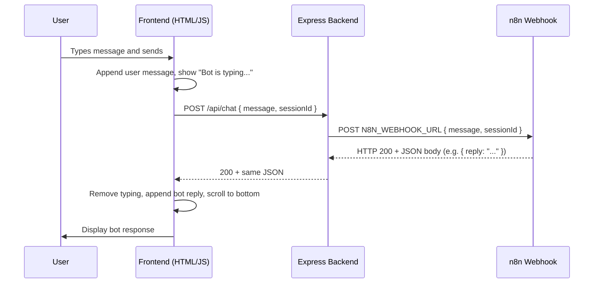

# Chat message flow

## Sequence diagram

## Steps

1. **User** enters a message and submits (Send or Enter).
2. **Frontend** adds the user message to the chat, shows “Bot is typing...”, and sends `POST /api/chat` with `message` and `sessionId`.
3. **Express** validates the body, then calls the n8n webhook with `POST` and JSON body `{ message, sessionId }`.
4. **n8n** runs the workflow and responds with JSON (e.g. `{ reply: "..." }`).
5. **Express** forwards that JSON as the response to the frontend.
6. **Frontend** hides the typing indicator, appends the bot reply (from `reply`, `text`, `message`, or `output`), and scrolls to the bottom.
